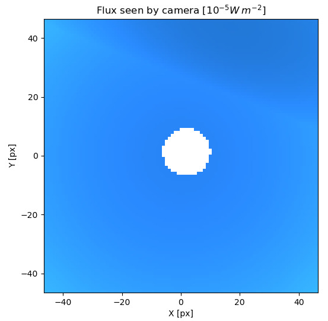

# Exoplanet Atmosphere Simulator

An interactive Python application for simulating how a star would appear through a planetary atmosphere using Monte Carlo radiative transfer.

This project models an observer standing on the surface of a planet and looks at how incoming starlight is scattered by the atmosphere before reaching the camera. The simulation estimates the atmospheric source function with a Monte Carlo photon-packet method, then performs ray tracing to render the observed sky and compute spectra. We implement an interactive desktop UI built with `PyQt5`.

The project is based on Dullemond's lectures [Radiative transfer in astrophysics](https://www.ita.uni-heidelberg.de/~dullemond/lectures/radtrans_2012/index.shtml).

## Overview

Solving radiative transfer in planetary atmospheres is challenging because scattering couples light coming from many directions. This project approaches that problem in two stages:

1. **Monte Carlo scattering**
   - Photon packets are emitted from the star
   - Packets travel through the atmosphere
   - Scattering events are sampled probabilistically
   - Their contribution is accumulated into a discretized source function

2. **Ray tracing & formal solution**
   - Rays are cast from the observer's camera through each pixel
   - The transfer equation is integrated through the atmosphere
   - The resulting spectral intensity is integrated into RGB to produce an image

The implementation currently focuses on a simplified atmosphere dominated by _Rayleigh scattering_, which is enough to produce a blue-sky image.

# Installation

We expect Python 3.14 or later. The following dependencies must be installed:

- numpy
- scipy
- matplotlib
- [pyqt](https://www.riverbankcomputing.com/software/pyqt/)
- [pyyaml](https://pyyaml.org/wiki/PyYAML)

A new anaconda environment can be setup with the following commands

`conda create -n exoplanets python=3.14`

`conda activate exoplanets`

`conda install numpy`

`conda install scipy`

`conda install matplotlib`

`conda install -c anaconda pyqt`

`conda install -c anaconda pyyaml`

# Execution

Activate the conda environment

`conda activate exoplanets`

Run the user interface via the command:

`python3 src/app.py`

Default parameters can be changed on `in/config.yaml`
